# MVP 静的構造設計

## 目的

ローカルMVPでは、J-Quants API Freeプランから取得したデータをSQLiteに保存し、StreamlitとPlotlyで日経225企業の株価・財務指標を可視化する。
このドキュメントでは、最小アプリを実装するためのクラス構成、責務、使用ライブラリを整理する。

## MVPの対象範囲

- 日経225銘柄リストの読み込み
- J-Quants API認証
- 銘柄情報、日次株価、財務情報の取得
- rawデータのローカル保存
- SQLiteへの整形済みデータ保存
- 自己資本比率、ROE、ROA、ROIなどの財務指標計算
- Streamlit画面での銘柄検索、表表示、折れ線グラフ表示

## 使用ライブラリ

| ライブラリ | 用途 |
|---|---|
| streamlit | Webアプリ画面、フォーム、テーブル、グラフ表示 |
| plotly | インタラクティブな折れ線グラフ作成 |
| pandas | APIレスポンス、CSV、DB取得結果の加工 |
| requests | J-Quants APIへのHTTPリクエスト |
| sqlite3 | MVP用SQLiteデータベース接続 |
| SQLAlchemy | DBアクセス層の抽象化。PostgreSQL移行を見据えて利用 |
| python-dotenv | `.env` からAPIキーなどの環境変数を読み込み |
| pydantic | 設定値や入力データの型定義、バリデーション |
| pathlib | ファイルパス操作 |
| logging | データ取得、DB保存、エラーのログ出力 |

## 推奨ディレクトリ構成

```text
stock_visualizer/
  main.py
  requirements.txt
  .env.example
  README.md
  documents/
    development_plan.md
    mvp_static_design.md
  data/
    nikkei225_companies.csv
    app.db
    raw/
      jquants/
    processed/
    exports/
  src/
    config/
      settings.py
    models/
      entities.py
    api/
      jquants_client.py
    db/
      database.py
      repositories.py
      schema.py
    services/
      data_fetch_service.py
      metrics_service.py
      chart_service.py
    ui/
      app.py
      components.py
```

## クラス構成

### Settings

役割: アプリ全体の設定値を管理する。

使用ライブラリ:

- pydantic
- python-dotenv
- pathlib

主な属性:

- `jquants_email`
- `jquants_password`
- `database_url`
- `data_dir`
- `raw_data_dir`

主なメソッド:

- `load()`: `.env` と環境変数から設定を読み込む
- `ensure_directories()`: `data/` や `data/raw/` を作成する

### JQuantsClient

役割: J-Quants APIとの通信を担当する。

使用ライブラリ:

- requests
- pandas
- logging

主な属性:

- `email`
- `password`
- `id_token`
- `refresh_token`
- `base_url`

主なメソッド:

- `authenticate()`: J-Quants APIへログインし、トークンを取得する
- `refresh_id_token()`: IDトークンを更新する
- `get_listed_info()`: 上場銘柄情報を取得する
- `get_daily_quotes(code, from_date, to_date)`: 日次株価を取得する
- `get_statements(code)`: 財務情報を取得する

### RawDataStorage

役割: APIから取得した未加工データをローカルファイルとして保存する。

使用ライブラリ:

- pathlib
- json
- pandas
- logging

主なメソッド:

- `save_json(source, category, data, file_name)`: JSON原本を保存する
- `save_csv(source, category, dataframe, file_name)`: CSV原本を保存する
- `load_json(path)`: 保存済みJSONを読み込む

将来のAWS移管時には、このクラスをS3保存版に差し替える。

### Database

役割: DB接続とトランザクション管理を担当する。

使用ライブラリ:

- SQLAlchemy
- sqlite3
- logging

主な属性:

- `database_url`
- `engine`

主なメソッド:

- `connect()`: DB接続を作成する
- `create_tables()`: 初期テーブルを作成する
- `get_session()`: DBセッションを返す

SQLiteでは `sqlite:///data/app.db` を利用し、将来はPostgreSQLのURLに切り替える。

### CompanyRepository

役割: 企業・銘柄情報の保存と取得を担当する。

使用ライブラリ:

- SQLAlchemy
- pandas

主なメソッド:

- `upsert_companies(companies)`: 銘柄情報を登録・更新する
- `find_all()`: 全銘柄を取得する
- `find_nikkei225()`: 日経225対象銘柄を取得する
- `find_by_code(code)`: 証券コードで企業を取得する
- `search(keyword)`: 会社名または証券コードで検索する

### PriceRepository

役割: 日次株価データの保存と取得を担当する。

使用ライブラリ:

- SQLAlchemy
- pandas

主なメソッド:

- `upsert_daily_prices(prices)`: 日次株価を登録・更新する
- `find_by_code(code, from_date, to_date)`: 銘柄別の株価時系列を取得する
- `find_latest_date(code)`: 銘柄ごとの最新取得日を取得する

### FinancialStatementRepository

役割: 財務諸表データの保存と取得を担当する。

使用ライブラリ:

- SQLAlchemy
- pandas

主なメソッド:

- `upsert_statements(statements)`: 財務情報を登録・更新する
- `find_by_code(code)`: 銘柄別の財務情報を取得する
- `find_latest_period(code)`: 銘柄ごとの最新決算期を取得する

### FinancialMetricRepository

役割: 計算済み財務指標の保存と取得を担当する。

使用ライブラリ:

- SQLAlchemy
- pandas

主なメソッド:

- `upsert_metrics(metrics)`: 財務指標を登録・更新する
- `find_by_code(code)`: 銘柄別の指標時系列を取得する
- `find_by_metric(metric_name)`: 指標単位で全銘柄の値を取得する

### DataFetchLogRepository

役割: データ取得処理の実行履歴を保存する。

使用ライブラリ:

- SQLAlchemy
- logging

主なメソッド:

- `start_job(job_name, target)`: 取得処理の開始ログを作成する
- `finish_job(job_id, status, message)`: 取得処理の終了ログを更新する
- `find_recent_logs(limit)`: 直近の取得ログを取得する

### FinancialMetricsCalculator

役割: 財務諸表と株価から主要な財務指標を計算する。

使用ライブラリ:

- pandas
- numpy

主なメソッド:

- `calculate_equity_ratio(statement)`: 自己資本比率を計算する
- `calculate_roe(statement)`: ROEを計算する
- `calculate_roa(statement)`: ROAを計算する
- `calculate_roi(statement)`: ROIを計算する
- `calculate_operating_margin(statement)`: 営業利益率を計算する
- `calculate_price_metrics(statement, price)`: PER、PBR、配当利回りを計算する
- `calculate_all(statements, prices)`: 銘柄ごとの指標を一括計算する

### DataFetchService

役割: API取得、raw保存、DB保存までの一連の流れを制御する。

使用ライブラリ:

- pandas
- logging

依存クラス:

- `JQuantsClient`
- `RawDataStorage`
- `CompanyRepository`
- `PriceRepository`
- `FinancialStatementRepository`
- `DataFetchLogRepository`

主なメソッド:

- `sync_companies()`: 銘柄情報を取得・保存する
- `sync_daily_prices(codes, from_date, to_date)`: 日次株価を取得・保存する
- `sync_financial_statements(codes)`: 財務情報を取得・保存する
- `sync_all_nikkei225()`: 日経225全銘柄のデータを同期する

### MetricsService

役割: 財務指標計算と保存を制御する。

使用ライブラリ:

- pandas
- logging

依存クラス:

- `FinancialStatementRepository`
- `PriceRepository`
- `FinancialMetricRepository`
- `FinancialMetricsCalculator`

主なメソッド:

- `calculate_for_code(code)`: 1銘柄分の指標を計算・保存する
- `calculate_for_codes(codes)`: 複数銘柄分の指標を計算・保存する
- `recalculate_all()`: 保存済み財務データから全指標を再計算する

### ChartService

役割: Plotlyグラフを生成する。

使用ライブラリ:

- plotly
- pandas

主なメソッド:

- `create_price_line_chart(prices)`: 株価折れ線グラフを作成する
- `create_metric_line_chart(metrics, metric_name)`: 財務指標折れ線グラフを作成する
- `create_comparison_chart(metrics, codes, metric_name)`: 複数企業比較グラフを作成する

### DashboardApp

役割: Streamlit画面全体を構成する。

使用ライブラリ:

- streamlit
- pandas

依存クラス:

- `CompanyRepository`
- `PriceRepository`
- `FinancialMetricRepository`
- `ChartService`
- `DataFetchLogRepository`

主なメソッド:

- `run()`: アプリ全体を起動する
- `render_sidebar()`: 銘柄選択、期間選択、指標選択を表示する
- `render_company_table()`: 日経225銘柄一覧を表示する
- `render_price_section(code)`: 株価グラフを表示する
- `render_metric_section(code, metric_name)`: 財務指標グラフを表示する
- `render_comparison_section(codes, metric_name)`: 複数企業比較を表示する
- `render_data_status()`: データ最終更新日時を表示する

## データモデル

MVPでは、まず以下のエンティティを定義する。

### Company

主な属性:

- `code`
- `company_name`
- `sector`
- `market`
- `is_nikkei225`

### DailyPrice

主な属性:

- `code`
- `date`
- `open`
- `high`
- `low`
- `close`
- `volume`
- `adjustment_close`

### FinancialStatement

主な属性:

- `code`
- `fiscal_period`
- `net_sales`
- `operating_profit`
- `ordinary_profit`
- `profit`
- `total_assets`
- `equity`
- `liabilities`
- `eps`
- `bps`
- `dividend`

### FinancialMetric

主な属性:

- `code`
- `fiscal_period`
- `equity_ratio`
- `roe`
- `roa`
- `roi`
- `operating_margin`
- `per`
- `pbr`
- `dividend_yield`

### DataFetchLog

主な属性:

- `job_name`
- `target`
- `started_at`
- `finished_at`
- `status`
- `message`

## MVPの処理フロー

### 初期データ取得

```text
DashboardApp
  ↓
DataFetchService.sync_all_nikkei225()
  ↓
JQuantsClient
  ↓
RawDataStorage
  ↓
Repository
  ↓
SQLite
```

### 財務指標計算

```text
MetricsService.calculate_for_codes()
  ↓
FinancialStatementRepository / PriceRepository
  ↓
FinancialMetricsCalculator
  ↓
FinancialMetricRepository
```

### 画面表示

```text
DashboardApp
  ↓
Repository
  ↓
ChartService
  ↓
Streamlit
```

## クラス関係図

```mermaid
classDiagram
    class DashboardApp {
        +run()
        +render_sidebar()
        +render_company_table()
        +render_price_section(code)
        +render_metric_section(code, metric_name)
    }

    class DataFetchService {
        +sync_companies()
        +sync_daily_prices(codes, from_date, to_date)
        +sync_financial_statements(codes)
        +sync_all_nikkei225()
    }

    class MetricsService {
        +calculate_for_code(code)
        +calculate_for_codes(codes)
        +recalculate_all()
    }

    class ChartService {
        +create_price_line_chart(prices)
        +create_metric_line_chart(metrics, metric_name)
        +create_comparison_chart(metrics, codes, metric_name)
    }

    class JQuantsClient {
        +authenticate()
        +get_listed_info()
        +get_daily_quotes(code, from_date, to_date)
        +get_statements(code)
    }

    class RawDataStorage {
        +save_json(source, category, data, file_name)
        +save_csv(source, category, dataframe, file_name)
        +load_json(path)
    }

    class Database {
        +connect()
        +create_tables()
        +get_session()
    }

    class CompanyRepository {
        +upsert_companies(companies)
        +find_all()
        +find_nikkei225()
        +search(keyword)
    }

    class PriceRepository {
        +upsert_daily_prices(prices)
        +find_by_code(code, from_date, to_date)
        +find_latest_date(code)
    }

    class FinancialStatementRepository {
        +upsert_statements(statements)
        +find_by_code(code)
        +find_latest_period(code)
    }

    class FinancialMetricRepository {
        +upsert_metrics(metrics)
        +find_by_code(code)
        +find_by_metric(metric_name)
    }

    class DataFetchLogRepository {
        +start_job(job_name, target)
        +finish_job(job_id, status, message)
        +find_recent_logs(limit)
    }

    class FinancialMetricsCalculator {
        +calculate_equity_ratio(statement)
        +calculate_roe(statement)
        +calculate_roa(statement)
        +calculate_roi(statement)
        +calculate_all(statements, prices)
    }

    class Settings {
        +load()
        +ensure_directories()
    }

    DashboardApp --> CompanyRepository
    DashboardApp --> PriceRepository
    DashboardApp --> FinancialMetricRepository
    DashboardApp --> ChartService
    DashboardApp --> DataFetchLogRepository

    DataFetchService --> JQuantsClient
    DataFetchService --> RawDataStorage
    DataFetchService --> CompanyRepository
    DataFetchService --> PriceRepository
    DataFetchService --> FinancialStatementRepository
    DataFetchService --> DataFetchLogRepository

    MetricsService --> FinancialStatementRepository
    MetricsService --> PriceRepository
    MetricsService --> FinancialMetricRepository
    MetricsService --> FinancialMetricsCalculator

    CompanyRepository --> Database
    PriceRepository --> Database
    FinancialStatementRepository --> Database
    FinancialMetricRepository --> Database
    DataFetchLogRepository --> Database

    Database --> Settings
    JQuantsClient --> Settings
    RawDataStorage --> Settings
```



## 実装順序

実装は、必要なテーブルをすべて先に作るのではなく、1つの画面価値を最短で通す縦スライス方式で進める。
最初に「1テーブルを作る」「データを入れる」「画面に表示する」までを完了させ、その後に必要なテーブル、クラス、処理を追加する。

### Step 1: 銘柄一覧の縦スライス

目的: 最初にDB保存からStreamlit表示までの基本ルートを完成させる。

作るもの:

- `Settings`
- `Database`
- `CompanyRepository`
- `DashboardApp`
- `companies` テーブル
- `data/nikkei225_companies.csv`

処理の流れ:

```text
CSV
  ↓
CompanyRepository.upsert_companies()
  ↓
companies table
  ↓
CompanyRepository.find_nikkei225()
  ↓
DashboardApp.render_company_table()
```

完了条件:

- `streamlit run main.py` でアプリが起動する
- CSVから読み込んだ日経225銘柄一覧をDBへ保存できる
- DBから取得した銘柄一覧を画面に表示できる

### Step 2: 株価表示の縦スライス

目的: 1銘柄の株価データを取得し、折れ線グラフで表示する。

追加するもの:

- `JQuantsClient`
- `RawDataStorage`
- `DataFetchService`
- `PriceRepository`
- `ChartService`
- `daily_prices` テーブル

処理の流れ:

```text
JQuantsClient.get_daily_quotes()
  ↓
RawDataStorage.save_json()
  ↓
PriceRepository.upsert_daily_prices()
  ↓
daily_prices table
  ↓
PriceRepository.find_by_code()
  ↓
ChartService.create_price_line_chart()
  ↓
DashboardApp.render_price_section()
```

完了条件:

- 1銘柄の株価をJ-Quants APIから取得できる
- 取得したrawデータをローカルに保存できる
- 整形済み株価をDBに保存できる
- Streamlit上で株価の時系列折れ線グラフを表示できる

### Step 3: 財務情報表示の縦スライス

目的: 1銘柄の財務情報を取得し、表で表示する。

追加するもの:

- `FinancialStatementRepository`
- `financial_statements` テーブル
- `DataFetchService.sync_financial_statements()`

処理の流れ:

```text
JQuantsClient.get_statements()
  ↓
RawDataStorage.save_json()
  ↓
FinancialStatementRepository.upsert_statements()
  ↓
financial_statements table
  ↓
FinancialStatementRepository.find_by_code()
  ↓
DashboardApp
```

完了条件:

- 1銘柄の財務情報を取得できる
- 財務情報をDBに保存できる
- Streamlit上で財務情報テーブルを表示できる

### Step 4: 財務指標計算の縦スライス

目的: 保存済み財務情報から主要指標を計算し、グラフで表示する。

追加するもの:

- `FinancialMetricsCalculator`
- `FinancialMetricRepository`
- `MetricsService`
- `financial_metrics` テーブル

処理の流れ:

```text
FinancialStatementRepository.find_by_code()
  ↓
FinancialMetricsCalculator.calculate_all()
  ↓
FinancialMetricRepository.upsert_metrics()
  ↓
financial_metrics table
  ↓
ChartService.create_metric_line_chart()
  ↓
DashboardApp.render_metric_section()
```

完了条件:

- 自己資本比率、ROE、ROA、ROIを計算できる
- 計算済み指標をDBに保存できる
- Streamlit上で財務指標の時系列折れ線グラフを表示できる

### Step 5: 複数銘柄比較

目的: 1銘柄アプリから日経225比較アプリへ広げる。

追加・拡張するもの:

- `CompanyRepository.find_nikkei225()`
- `DataFetchService.sync_all_nikkei225()`
- `MetricsService.calculate_for_codes()`
- `ChartService.create_comparison_chart()`
- `DashboardApp.render_comparison_section()`

完了条件:

- 複数銘柄の株価または財務指標を比較できる
- 表示期間と指標を画面から選択できる

### Step 6: 運用補助機能

目的: MVPを継続的に使える状態へ近づける。

追加するもの:

- `DataFetchLogRepository`
- `data_fetch_logs` テーブル
- エラー時のログ保存
- データ最終更新日時の表示

完了条件:

- データ取得の成功・失敗を確認できる
- 画面上でデータ最終更新日時を確認できる

## PostgreSQL移行を見据えた設計方針

- DBアクセスはRepositoryクラスに閉じ込める。
- アプリ画面から直接SQLを書かない。
- DB接続先は `Settings.database_url` で切り替える。
- SQLite固有のSQLはできるだけ避ける。
- rawデータ保存は `RawDataStorage` に閉じ込め、将来S3版へ差し替えやすくする。
- J-Quants APIとの通信は `JQuantsClient` に閉じ込める。

## 最小実装時に後回しにするもの

- ユーザー認証
- AWS S3保存
- RDS PostgreSQL接続
- FastAPI
- React
- 高度なランキング画面
- お気に入り銘柄
- 課金、権限管理
